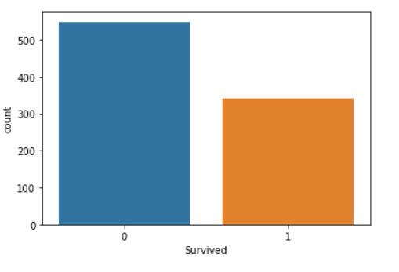
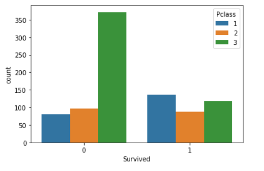
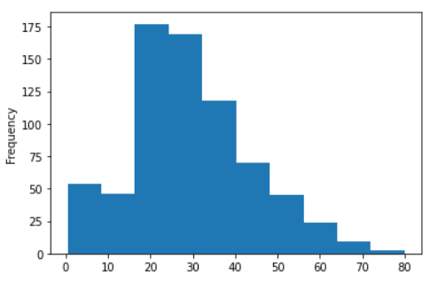
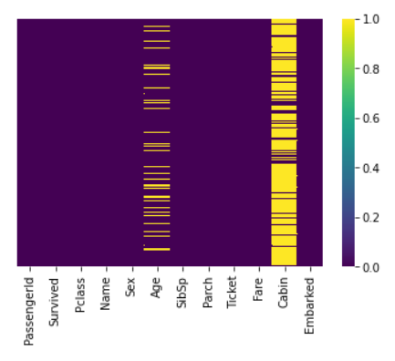

# Logistic-Regression-Titanic-Machine-Learning-from-Disaster

Logistic regression is a technique in statistical analysis that attempts to predict a data value based on prior observations. A logistic regression algorithm looks at the relationship between a dependent variable and one or more dependent variables.

                                              Source: National Geographic Channel
  
## How to Get Dataset

The dataset was available on [kaggle - Titanic-dataset](https://www.kaggle.com/c/titanic/data).

## Visualizing data before processing

How many survived and how many people did not survive

How many people of which class survived

Age plot
  

  
Analysing missing values with help of heat map

## Evaluating model with confusion matrix

from sklearn.metrics import confusion_matrix
confusion_matrix(y_test,predictions)

array([[105,  21],
       [ 24,  64]], dtype=int64)
       
## Accuracy

from sklearn.metrics import accuracy_score

accuracy_score(y_test, predictions)*100

78.97196261682244

Accuracy: Overall, how often is the classifier correct?
(TP+TN)/total = (102+63)/214 = 0.771028

## Misclassification rate
mis_cla_rate  = (45)/len(y_test)

0.21028
